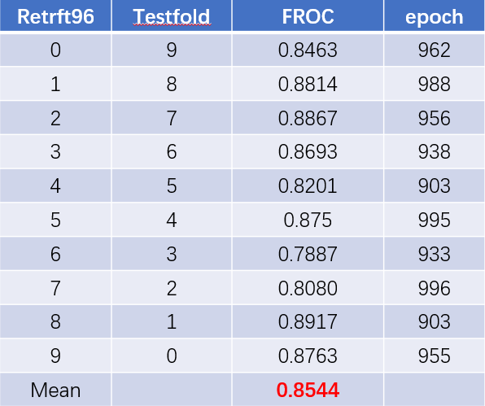

# DeepLung PyTorch1.0 Python3.7 with multi GPUs

# Illustration

The project is based on wentaozhu's work to upgrade and modify the version, and add some additional visualization functions.The original version is applicable to python 2.7 and pytorch 0.1 from https://github.com/wentaozhu/DeepLung, and the Paper link is https://arxiv.org/pdf/1801.09555.pdf (DeepLung: Deep 3D Dual Path Nets for Automated Pulmonary Nodule Detection and Classification." IEEE WACV, 2018.), and  https://arxiv.org/pdf/1805.05373.pdf (Deepem: Deep 3d convnets with em for weakly supervised pulmonary nodule detection, MICCAI, 2018.) Please cite this paper if you find this project helpful for your research.膜拜大佬!!!

# Dependencies

python 3.7, CUDA 10.1,SimpleITK 1.2.2, numpy 1.17, matplotlib 3.1.1, scikit-image (0.21), scipy (0.3.1), pyparsing (2.4.2), pytorch (1.0) (anaconda is recommended) other packages could be the latest version.

# Instructions for runing

# Training:

# 1.Install all dependencies
# 2.Download dataset:
Download luna data from https://luna16.grand-challenge.org/download/, and Download LIDC-IDRI dataset from https://wiki.cancerimagingarchive.net/display/Public/LIDC-IDRI.

# 3.Proprocess data:

For preprocessing, run ./DeepLung-Minerva/prepare.py. The parameters for prepare.py is in config_training.py.
*_data_path is the unzip raw data path for LUNA16.
*_preprocess_result_path is the save path for the preprocessing.
*_annos_path is the path for annotations.
*_segment is the path for LUNA16 segmentation, which can be downloaded from LUNA16 website.

3.1 The function of preprocess_luna in 662 line proproces luna data, and generate mask.npy clean.npy labe.npy spacing.npy,extendbox.npy,origin.npy to subset folder of config['preprocess_result_path'].

# 4.Run detector：

cd ./detector 
For Training
python main.py --model dpn3d26 -b 8  --save-dir dpn3d26/retrft96X/ --epochs 1000 --config config_trainingX
You should modify X from 0-9 to train 10 models for 10 fold cross validation

You can modify -b(batch_size) depend on your GPU memory and number.

For Testing
python main.py --model dpn3d26 -b 1 --resume results/dpn3d26/retrft96X/CkptFile/1000.ckpt --test 1 --save-dir dpn3d26/retrft96X/ --config config_trainingX
You should modify X from 0-9 to test 10 models for 10 fold cross validation
mkdir in results/res18/retrft96X/val/#(X=0-9)
mv results/res18/retrft96X/bbox/*.npy results/res18/retrft96X/val/

You can use the ResNet or dual path net model by revising --model attribute.
After training and test are done, use the ./evaluationScript/frocwrtdetpepchluna16.py to validate the epoch used for test.
After that, collect all the 10 folds' prediction, use ./evaluationScript/noduleCADEvaluationLUNA16.py to get the FROC for all 10 folds.
You can directly run noduleCADEvaluationLUNA16.py, and get the performance in the paper.

The trained model is in ./detector/dpnmodel/ or ./detector/resmodel/ The performances on each fold are (these results are in the supplement)

# 4.Run classifier：

For nodule classification, first clean the data from LIDC-IDRI.
Use the ./data/extclsshpinfo.py to extract nodule labels.
humanperformance.py is used to get the performance of doctors.

dimcls.py is used to get the classification based on diameter.
nodclsgbt.py is used to get the performance based on GBM, nodule diameter and nodule pixel.
pthumanperformance.py is used for patient-level diagnosis performance.
kappatest.py is used for kappa value calculation in the paper.

For classification using DPN, use the code in main_nodcls.py.
You may revise the code a little bit for different test settings.

For system's classification, that is classification based on detection.
First, use the detection's test script in the run_training.sh to get the detected nodules for training CTs.
Use the det2cls.py to train the model. And use the testdet2cls.py to test the trained model.
You may revise the code a little bit for different test settings.

Doctor's annotation for each nodule in LIDC-IDRI is in ./nodcls/annotationdetclssgm_doctor.csv

LIDC-IDRI nodule size report downloaded from http://www.via.cornell.edu/lidc/list3.2.csv is in /nodcls/data/list3.2.csv

